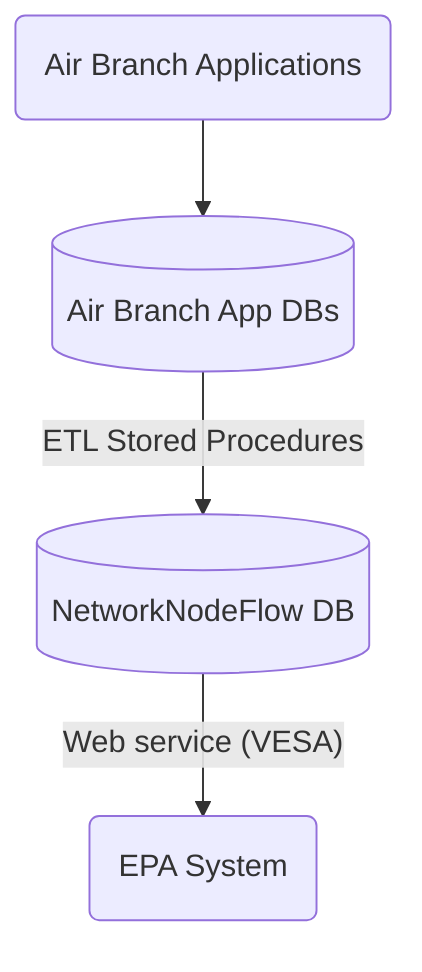

# EPA/ICIS-Air Data Exchange

This repository tracks the data exchange for EPA's [ICIS-Air](https://icis.epa.gov/icis/) system.

Data are reported by APB staff via the IAIP to the `AIRBRANCH` database and via the Air Web App to the `air-web`
database. The data are staged in the `NETWORKNODEFLOW` database using stored procedures that run on a daily schedule.
Finally, the data are sent to EPA through CDX using the [Virtual Exchange Service (VES)](https://ves.epa.gov/VESA/) on a
weekly schedule.

## Data flow

## ETL stored procedures

`AIRBRANCH.etl.ICIS_Stage_All` runs daily and calls the following stored procedures in order

* `AIRBRANCH.etl.ICIS_FACILITY_UPDATE`
* `AIRBRANCH.etl.ICIS_CMS_UPDATE`
* `AirWeb.etl.ICIS_ComplianceMonitoring_Update`
* `AirWeb.etl.ICIS_ComplianceMonitoring_Delete`
* `AirWeb.etl.ICIS_CaseFile_Update`
* `AirWeb.etl.ICIS_CaseFile_Delete`
* `AIRBRANCH.etl.ICIS_CMS_DELETE`
* `AIRBRANCH.etl.ICIS_POLLUTANT_DELETE`
* `AIRBRANCH.etl.ICIS_AIRPROGRAM_DELETE`
* `AIRBRANCH.etl.ICIS_FACILITY_DELETE`

# VESA scheduled tasks

The following services run on a weekly basis in VES.

## Deletions

|  # | Service                            | Test Node | Production Node |
|---:|------------------------------------|:---------:|:---------------:|
|  1 | SubmitDeletedCaseFileToCMLink      | Tue 07:05 |    Thu 07:05    |
|  2 | SubmitDeletedCaseFileToDAEALink    | Tue 07:15 |    Thu 07:15    |
|  3 | SubmitDeletedDAFormalEAData        | Tue 07:25 |    Thu 07:25    |
|  4 | SubmitDeletedDAInFormalEAData      | Tue 07:35 |    Thu 07:35    |
|  5 | SubmitDeletedDACaseFile            | Tue 07:45 |    Thu 07:45    |
|  6 | DeleteAgencyComplianceMonitoring   | Tue 07:55 |    Thu 07:55    |
|  7 | DeleteTVACC                        | Tue 08:10 |    Thu 08:10    |
|  8 | DeleteComplianceMonitoringStrategy | Tue 08:20 |    Thu 08:20    |
|  9 | DeleteAirPollutant                 | Tue 08:30 |    Thu 08:30    |
| 10 | DeleteAirProgram                   | Tue 08:40 |    Thu 08:40    |
| 11 | DeleteAirFacility                  | Tue 08:50 |    Thu 08:50    |

## Additions

|  # | Service                            | Test Node | Production Node |
|---:|------------------------------------|:---------:|:---------------:|
| 12 | SubmitAirFacilityData              | Tue 09:20 |    Thu 09:20    |
| 14 | SubmitAirProgramData               | Tue 10:10 |    Thu 10:10    |
| 13 | SubmitAirPollutantData             | Tue 10:30 |    Thu 10:30    |
| 15 | SubmitComplianceMonitoringStrategy | Tue 10:50 |    Thu 10:50    |
| 16 | SubmitAgencyComplianceMonitoring   | Tue 11:10 |    Thu 11:10    |
| 17 | SubmitTVACCData                    | Tue 12:30 |    Thu 12:30    |
| 18 | SubmitDACaseFileData               | Tue 12:50 |    Thu 12:50    |
| 20 | SubmitCaseFile2CMLink              | Tue 13:10 |    Thu 13:10    |
| 19 | SubmitDAFormalEAData               | Tue 13:30 |    Thu 13:30    |
| 21 | SubmitDAInFormalEAData             | Tue 13:50 |    Thu 13:50    |
| 22 | SubmitCaseFile2DAEALink            | Tue 14:10 |    Thu 14:10    |
| 23 | SubmitEAMilestoneData              | Tue 14:30 |    Thu 14:30    |

